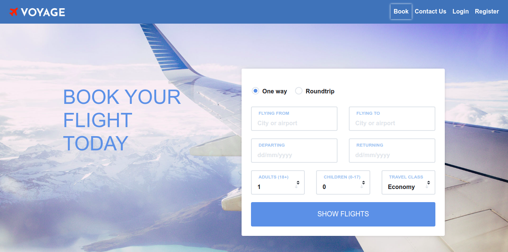
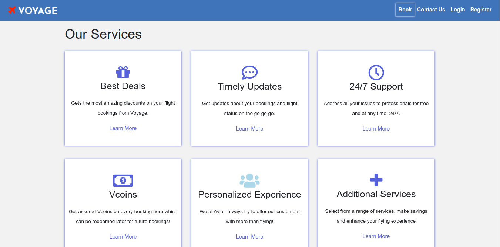
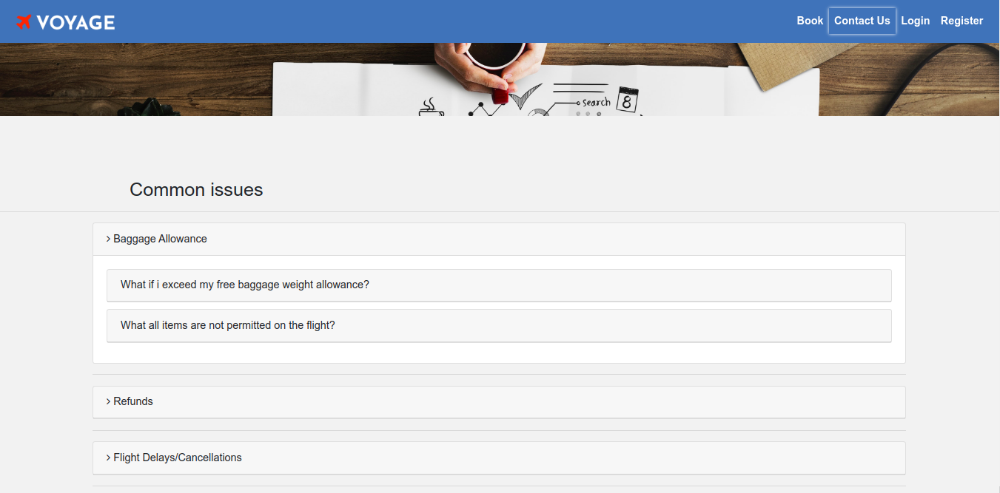
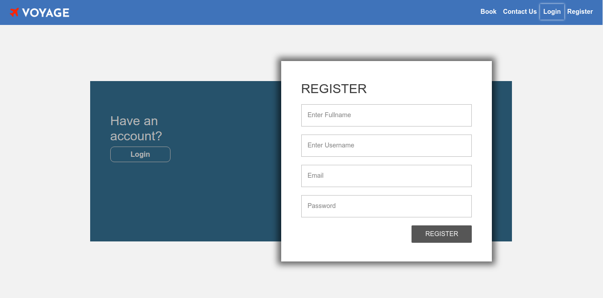

    
 
 

# Voyage
Voyage is an Airline Reservation system that provides the most basic functionalities developed using Flask

# Features
- Register and Login user.
- Modify user profile.
- Search for flights(flights data is obtained from publicly available datasets).
- Book a flight and access booking history as well.

# Working
- Uses a Flask server to process data and render web pages.
- Uses AJAX for dynamically change contents of web pages.
- Flask server communicates with PostgreSQL database server to store and retrieve data.

# Screenshots

      
        
     
      
        
     
      
        
     
      
        
     

# TODOs
- [ ] Integrate payment functionality with existing application.
- [ ] Send mail notifications/updates to users prior to thier flights. 
- [ ] Update static flights data with real-time data if possible.

 

---

This project was developed as a part of our college course WP mini-project by [Avi](https://github.com/aviiiij), [Vatsal](https://github.com/vatsal1999) and [me](https://github.com/SaurabhNandy).
